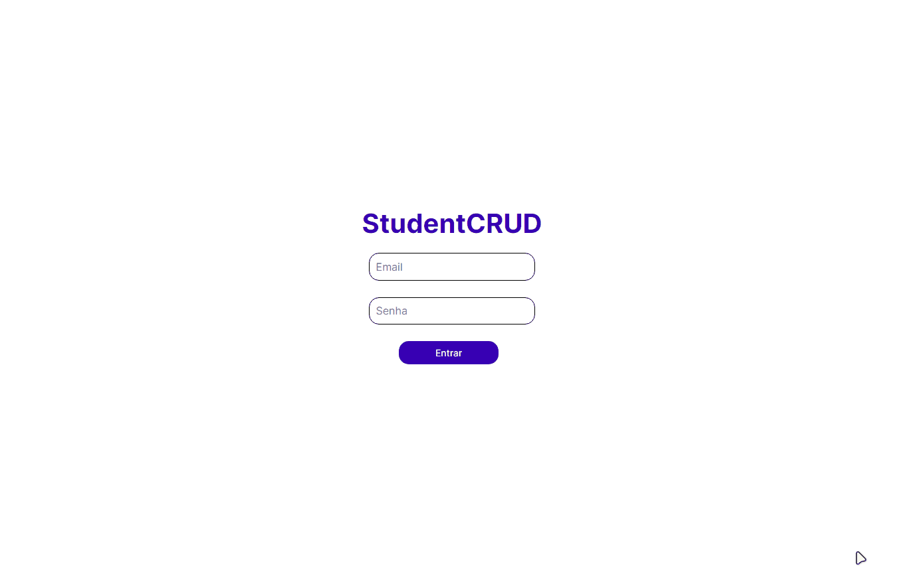

<h1 align="center"> StudentCRUD </h1>

  <a href="#tecnologias-">Tecnologias</a>&nbsp;&nbsp;&nbsp;|&nbsp;&nbsp;&nbsp;
  <a href="#sobre-">Sobre</a>

 
  StudentCRUD é um CRUD capaz de mostrar a tabela de alunos, criar um novo aluno, editar e apagar.

  

## Tecnologias 👨‍💻 
Esse projeto foi desenvolvido com as seguintes tecnologias:
- CSS
- Bootstrap
- Javascript
- PHP
- MySQL

## Sobre 📖

### Descrição
StudentCRUD é um CRUD capaz de mostrar a tabela de alunos, criar um novo aluno, editar e apagar. Os dados dos alunos são salvos em um banco de dados MySQL. Além disso, o sistema possui uma área de login, permitindo o acesso apenas ao admin.

### Objetivo
Praticar conceitos aprendidos no projeto de extensão da UCPel. Entre eles:

- Conceitos da linguagem PHP, como GET e POST
- Utilização do banco de dados e manipulação de tabelas
- Estilização e responsividade

by [William Bierhals](https://github.com/will1Zera)

